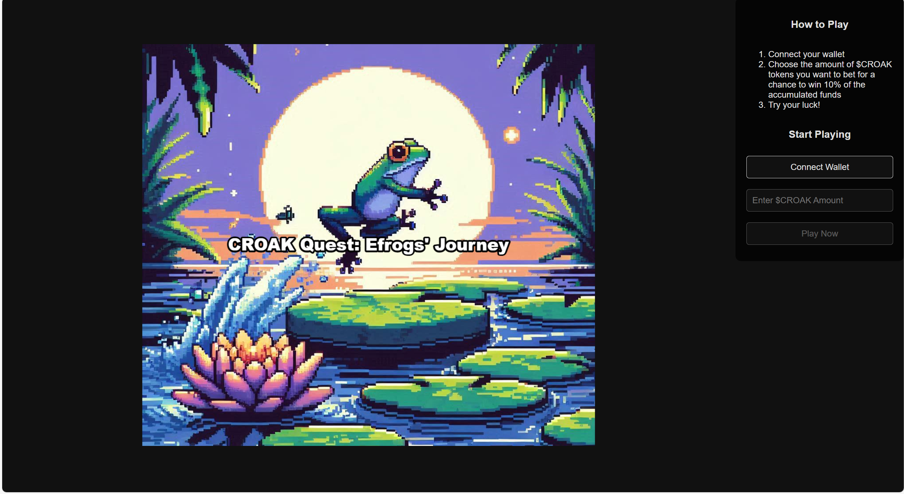

# 🐸 CROAK Quest: Efrogs' Journey

CROAK Quest: Efrogs' Journey is a blockchain-powered game that combines the charm of classic arcade games with the excitement of Web3 technology.

## Important Notice

This is a **demo project** built for the Linea Dev Cook-Off challenge. While you can play and interact with it on the Linea mainnet, please be aware of the following:

-   Linea transaction fees are low, and $CROAK tokens have minimal value.
-   **Do not input more than a few cents worth of tokens when betting, as you may lose them.**

[View the Smart Contract on Linea Mainnet](https://lineascan.build/address/0xae685dbbf74a5684d25ee24d00ff33ac38b7b362)

## Key Features

-   **Blockchain Integration**: Connect your crypto wallet to play and verify Efrogs NFT ownership.
-   **$CROAK Betting System**: Use $CROAK tokens to power up your frog's jumps.
-   **Efrogs NFT Ownership**: Personalize your in-game frog with your Efrogs NFT.
-   **Charming Visuals**: Enjoy ~~vibrant graphics~~ poorly drawn pixel art that bring the pond and its inhabitants to life.

## Technology Stack

-   Phaser 3
-   React
-   Vite
-   Hardhat
-   Solidity

This project is built upon the Phaser 3 React Template. For more details, refer to the [official GitHub repository](https://github.com/phaserjs/template-react).

## Getting Started

### Prerequisites

-   [Node.js](https://nodejs.org) (for dependency installation and script execution)

### Installation and Usage

1. Clone the repository
2. Install dependencies:

    ```
    npm install
    ```

3. Run the development server:

    ```
    npm run dev
    ```

## Available Commands

| Command          | Description                                    |
| ---------------- | ---------------------------------------------- |
| `npm install`    | Install project dependencies                   |
| `npm run dev`    | Launch a development web server                |
| `npm run build`  | Create a production build in the `dist` folder |
| `npm run test`   | Run the test suite                             |
| `npm run deploy` | Build and deploy to GitHub Pages               |

## Screenshot



## Contributing

Contributions are welcome! Please feel free to submit a Pull Request.

## License

This project is licensed under the [MIT License](LICENSE).
